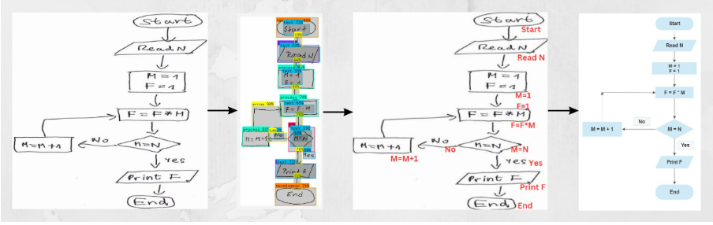

# Image2MarkUp

## INSPIRATION
- A Digital Conversion of hand-Drawn flowcharts that clearly explains the approach of a problem solver using Deep learning. Flowcharts , UML Models ,Finite automata are key artifacts in Software engineers' contexts. 
- The availability of various tools over the Internet for drawing digital diagrams by joining various notations takes considerable time,effort, and friction and there may be no presence of a laptop/ desktop .These tools do not provide means for effective communication and collaboration that are required for creating diagrams. So,  A developer has to sketch a whiteboard or piece of paper. The paper on which the hand-drawn model was drawn may be lined, squared or dotted. The paper adds numerous lines to drawing which may appear similar to lines used to denote notations.It however,creates a need to transform model diagrams into digital counterparts that are processed by analysis tools. Hand-Drawn Flowcharts do not address the recognition of edges or textual labels.

## FEATURES
- 1. It uses a neural network based architecture to recognize notations, edges and textual labels of expressive flowcharts.
- 2. It provides comprehensive transformation of hand drawn flowcharts, including proper handling of textual labels and message flows.
- 3. It reliably recognizes hand-drawn flowcharts from scanned images and hence remove undesirable friction in workflow.

## STEPS INVOLVED
1. Dataset collection
2. Data Wrangling
3. Image Augmentation
4. Image Preprocessing
5. Labelling and Annotation on RoboFlow
6. Object detection using YOLOv8
7. Object recognition
8. Text detection and recognition using Tesseract

## SAMPLE IMAGES

	

